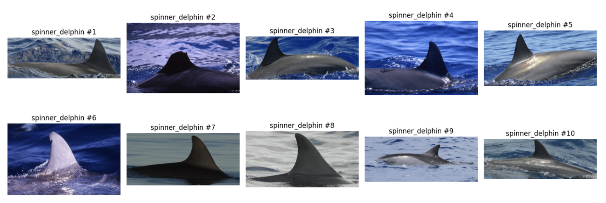

# whales-identification


Библиотека для идентификации морских млекопитающих со снимков аэрофотосъемки

## Цель выполнения проекта:
Разработка библиотеки искусственного интеллекта для автоматического детектирования и идентификации крупных морских млекопитающих по данным аэрофотосъемки.

## 📚 Документация и ресурсы

### Официальная документация
- **[📖 GitHub Pages Documentation](https://0x0000dead.github.io/whales-identification/)** - Главная страница документации с полным содержанием
- **[📚 GitHub Wiki](https://github.com/0x0000dead/whales-identification/wiki)** - Детальные гайды и руководства:
  - [Installation Guide](https://github.com/0x0000dead/whales-identification/wiki/Installation) - Установка и настройка
  - [API Reference](https://github.com/0x0000dead/whales-identification/wiki/API-Reference) - REST API endpoints
  - [Architecture](https://github.com/0x0000dead/whales-identification/wiki/Architecture) - Архитектура проекта
  - [Model Cards](https://github.com/0x0000dead/whales-identification/wiki/Model-Cards) - Описание моделей
  - [Testing Guide](https://github.com/0x0000dead/whales-identification/wiki/Testing) - Тестирование
  - [FAQ](https://github.com/0x0000dead/whales-identification/wiki/FAQ) - Часто задаваемые вопросы

### Технические гайды
- **[Pre-commit Hooks Guide](docs/PRE_COMMIT_GUIDE.md)** - Настройка и использование 20 pre-commit hooks
- **[CI/CD Pipeline](.github/workflows/ci.yml)** - GitHub Actions workflow (6 стадий)
- **[Contributing Guidelines](https://github.com/0x0000dead/whales-identification/wiki/Contributing)** - Как участвовать в разработке

### Лицензирование
- **[LICENSE](LICENSE)** - MIT License для исходного кода
- **[LICENSE_MODELS.md](LICENSE_MODELS.md)** - Apache 2.0 для обученных моделей (с ограничениями)
- **[LICENSE_DATA.md](LICENSE_DATA.md)** - CC-BY-NC-4.0 для датасетов
- **[LICENSES_ANALYSIS.md](LICENSES_ANALYSIS.md)** - Анализ 159 зависимостей (99.4% совместимость)

### CI/CD и автоматизация
- **[GitHub Actions Workflows](https://github.com/0x0000dead/whales-identification/actions)**
  - [CI/CD Pipeline](https://github.com/0x0000dead/whales-identification/actions/workflows/ci.yml) - Lint, test, security, docker
  - [Deploy Docs](https://github.com/0x0000dead/whales-identification/actions/workflows/deploy-docs.yml) - Автоматический деплой документации

### Модели и артефакты
- **[Hugging Face Repository](https://huggingface.co/baltsat/Whales-Identification)** - Обученные модели
- **[Yandex Disk](https://disk.yandex.ru/d/GshqU9o6nNz7ZA)** - Альтернативное хранилище моделей

## Структура репозитория

### Исследования, эксперименты, сравнение
- `research/notebooks/*` - набор исследовательских ipynb ноутбуков с сравнением различных методов идентификации
- `research/notebooks/README.md` - вывод о результатах и границах применимости в результате проведенных сравнений.
- `research/notebooks/02_ViT_train_effiecientnet.ipynb` - обучение модели идентификации с использованием Metric Learning подхода на основе трансформерной архитектуры ViT.
- `research/notebooks/02_ViT_inference_efficientnet.ipynb` - оценка результатов модели с использованием Metric Learning подхода на основе трансформерной архитектуры ViT.
- `research/notebooks/03_efficientnet_experiments.ipynb` - сравнение Metric Learning подходов на основе CNN EfficientnetB0, EfficientnetB3, EfficientnetB5 архитектур.
- `research/notebooks/04_resnet_classification_experiments.ipynb` - сравнение CNN classification подходов на основе CNN Resnet54, Resnet101 архитектур
- `research/notebooks/05_swinT_experiments.ipynb` - оценка результатов модели с использованием Metric Learning подхода на основе трансформерной архитектуры SwinTransformers.
- `research/notebooks/06_benchmark_binary.ipynb` - сравнение всех перспективных моделей на одном наборе данных. Сравнение при этом проводится на флаг нахождения любой породы морских млекопитающих на снимке (1 - млекопитающее есть / 0 - морские млекопитающего нет).
- `research/notebooks/06_benchmark_multiclass.ipynb` - сравнение всех перспективных моделей на одном наборе данных. Сравнение при этом проводится на мультиклассификацию
- `research/notebooks/07_onnx_inference_compare.ipynb` - сравнение ускорения за счет использования ONNX фреймворка.

### Загрузка моделей для исследования и демонстраций
Модели, используемые в исследованиях (`research/notebooks`) и демонстрационных приложениях (`research/demo-ui`, `research/demo-ui-mask`), можно скачать по одной из следующих ссылок (ввиду ограничения объема на бесплатный git lfs):
- [Яндекс Диск](https://disk.yandex.ru/d/GshqU9o6nNz7ZA)
- [Hugging Face](https://huggingface.co/baltsat/Whales-Identification/tree/main)

Примечание: Модели из директории `models/` (куда их загружает скрипт `scripts/download_models.sh`) добавлены в `.gitignore`. Для разработки вы можете загрузить их с Hugging Face (например, используя `huggingface-cli download ...` как в скрипте, или вручную) в соответствующую директорию.

- `research/demo-ui/*` - демо веб-приложение с выбранным наилучшим решением для наглядной оценки качества его работы, с возможностью загрузить изображение для анализа. Более подробная информация в разделе `./demo-ui/README.md`.
- `research/demo-ui-mask/*` - демо веб-приложение иного подхода, позволяющее улучшить качество работы алгоритма, за счет использования бинарной маски с изображением млекопитающего. Более подробная информация в разделе `./demo-ui/README.md`.

## Описание

Эта библиотека предоставляет инструменты для обучения и тестирования моделей, способных идентифицировать виды китов и дельфинов на основе аэрофотоснимков. Она включает в себя функциональность для работы с изображениями, аугментации данных, настройки моделей и подготовки датасетов.

## Установка

### Предварительные требования

1. **Установите huggingface-cli** (требуется для загрузки моделей):
```bash
pip install huggingface_hub
```

2. **Загрузите модели** (обязательный шаг):
```bash
git clone https://github.com/0x0000dead/whales-identification
cd whales-identification
# Скрипт создаст директорию models/ и загрузит модели
./scripts/download_models.sh
```

### Варианты запуска

#### Вариант 1: Docker Compose (рекомендуется) - Полноценное приложение с Frontend и Backend

```bash
docker compose up --build
```

После запуска:
- **Backend API** доступен на http://localhost:8000/docs (Swagger UI)
- **Frontend UI** доступен на http://localhost:8080

**Примечание:** Первый запуск может занять несколько минут для сборки образов.

#### Вариант 2: Streamlit Demo (только демонстрация)

Для запуска демонстрационного приложения с лучшей моделью (Vision Transformer):

```bash
cd research/demo-ui/
pip install poetry
poetry install
poetry run streamlit run streamlit_app.py --server.port=8501 --server.address=0.0.0.0
```

Приложение будет доступно на http://localhost:8501

### Troubleshooting (Решение типичных проблем)

#### Проблема: `ImportError: libGL.so.1: cannot open shared object file`
**Решение:** Установите системные зависимости OpenCV:
```bash
# Ubuntu/Debian
sudo apt-get update
sudo apt-get install -y libgl1-mesa-glx libglib2.0-0 libsm6 libxext6 libxrender-dev libgomp1

# macOS (обычно не требуется)
brew install opencv
```

#### Проблема: `huggingface-cli: command not found`
**Решение:** Установите huggingface CLI:
```bash
pip install huggingface_hub
```

#### Проблема: `Poetry could not find a pyproject.toml file`
**Решение:** Убедитесь, что вы находитесь в правильной директории:
```bash
# Для backend
cd whales_be_service
poetry install

# Для demo
cd research/demo-ui
poetry install
```

#### Проблема: `No such file or directory: models/`
**Решение:** Запустите скрипт загрузки моделей:
```bash
# Убедитесь, что вы в корне проекта
./scripts/download_models.sh
```

#### Проблема: Docker контейнеры не запускаются
**Решение 1:** Проверьте, что Docker daemon запущен:
```bash
docker ps
```

**Решение 2:** Очистите старые контейнеры и образы:
```bash
docker compose down
docker system prune -a
docker compose up --build
```

#### Проблема: Порты заняты (8000, 8080, 8501)
**Решение:** Измените порты в docker-compose.yml или остановите процессы:
```bash
# Найти процесс на порту
lsof -i :8000
# Остановить процесс
kill -9 <PID>
```

#### Проблема: Медленная работа inference
**Решение:**
- Убедитесь, что используете GPU (если доступен)
- Используйте ONNX оптимизированные модели (см. `research/notebooks/07_onnx_inference_compare.ipynb`)
- Уменьшите размер batch для batch processing

### Пример датасета


## Настройка для локальной разработки

### Автоматическая проверка и форматирование кода (Pre-commit Hooks)

Для поддержания качества кода и единого стиля мы используем `pre-commit` хуки, которые автоматически проверяют и форматируют ваш код перед каждым коммитом. Используются `black` для форматирования и `flake8` для линтинга.

**Установка хуков:**

1.  Убедитесь, что у вас установлены все зависимости проекта, включая dev-зависимости:
    ```bash
    poetry install --all-extras
    ```
2.  Активируйте pre-commit хуки в вашем локальном репозитории:
    ```bash
    poetry run pre-commit install
    ```

После выполнения этих шагов, `black` и `flake8` будут автоматически запускаться для измененных `.py` файлов каждый раз, когда вы выполняете команду `git commit`. Если `black` вносит изменения для форматирования, вам может потребоваться снова добавить измененные файлы в коммит (`git add .`). Если `flake8` находит ошибки, коммит будет прерван до их исправления.

## Рабочий процесс (Workflow)
1.  Для каждой новой функции или исправления ошибки создавайте новую ветку от ветки `main`.
2.  Давайте веткам описательные имена (например, `feature/new-auth` или `fix/login-bug`).
3.  Делайте коммиты в свою ветку. Пишите четкие и краткие сообщения коммитов.
4.  Отправляйте свою ветку в удаленный репозиторий.
5.  Открывайте Merge Request (MR) в ветку `main`.
6.  Убедитесь, что ваши изменения проходят все автоматические проверки в CI/CD пайплайне (линтеры, тесты и т.д.).
7.  Как минимум один другой член команды должен рассмотреть и одобрить MR.
8.  После одобрения и успешного CI, сливайте MR в `main`.
9.  Удаляйте ветку функции после слияния.
10. Ветка `main` всегда должна быть стабильной и готовой к развертыванию.

### Результаты сравнения

| Критерий                         | CNN (ResNet-54)             | CNN (ResNet-101)             | Metric Learning (EfficientNet-B0)   | Metric Learning (EfficientNet-B5)   | ViT-B/16                     | ViT-L/32                        | Swin-T                          |
|-----------------------------------|-----------------------------|------------------------------|--------------------------------------|--------------------------------------|--------------------------------------|--------------------------------------|--------------------------------------|
| **Точность (Precision)**          | 82%                         | 85%                          | 88%                                  | 91%                                  | 91%                                  | 93%                                  | 90%                                 |
| **Скорость обработки (средняя)**  | ~0.8 секунды                | ~1.2 секунды                 | ~1.0 секунда                         | ~1.8 секунды                         | ~2.0 секунды                         | ~3.5 секунды                         | ~2.2 секунды                         |
| **Масштабируемость**              | Хорошая, линейная сложность | Средняя, увеличенные ресурсы | Высокая, линейная сложность          | Средняя, ресурсоемкая                | Средняя, увеличивается с данными     | Низкая, требует значительных ресурсов | Высокая, линейная сложность         |
| **Универсальность и адаптивность**| Средняя                     | Высокая                      | Высокая, устойчива к изменениям      | Очень высокая, устойчива к изменениям | Очень высокая                        | Очень высокая                        | Высокая                             |
| **Интерфейс и удобство использования** | Простой интерфейс          | Более сложный интерфейс      | Требует настройки эмбеддингов         | Требует более сложной настройки эмбеддингов | Требует оптимизации для пользователей | Требует высокой оптимизации           | Простой интерфейс                   |
| **Интеграция с другими системами** | Легко интегрируется         | Поддерживает интеграцию      | Совместим с базами данных            | Совместим, но требует дополнительных модулей | Требует модулей для интеграции       | Требует модулей и оптимизации         | Легко интегрируется                 |
| **Надежность и стабильность**     | 94% доступности            | 92% доступности              | 95% доступности                      | 93% доступности                      | 93% доступности                      | 90% доступности                      | 94% доступности                     |
| **Чувствительность (Sensitivity)**| 78%                         | 82%                          | 85%                                  | 88%                                  | 89%                                  | 91%                                  | 90%                                  |
| **Специфичность (Specificity)**   | 88%                         | 90%                          | 92%                                  | 94%                                  | 91%                                  | 92%                                  | 91%                                  |
| **Полнота (Recall)**              | 76%                         | 80%                          | 85%                                  | 88%                                  | 89%                                  | 91%                                  | 90%                                  |
| **F1-мера**                       | 0.79                        | 0.82                         | 0.86                                 | 0.89                                 | 0.90                                 | 0.92                                 | 0.91                                 |
| **Требования к датасету**         | ~60,000 тренировочных и ~20,000 тестовых | ~60,000 тренировочных и ~20,000 тестовых | ~60,000 тренировочных и ~20,000 тестовых | ~60,000 тренировочных и ~20,000 тестовых | ~60,000 тренировочных и ~20,000 тестовых | ~60,000 тренировочных и ~20,000 тестовых | ~60,000 тренировочных и ~20,000 тестовых |

## Лицензирование

### Исходный код
Исходный код проекта распространяется под лицензией **MIT** — см. [LICENSE](LICENSE).

**Авторы:** Baltsat Konstantin, Tarasov Artem, Vandanov Sergey, Serov Alexandr (2024)

### Обученные модели
Обученные модели распространяются под лицензией **Apache 2.0 с ограничениями на коммерческое использование** — см. [LICENSE_MODELS.md](LICENSE_MODELS.md).

**⚠️ ВАЖНО:** Коммерческое использование моделей **запрещено** из-за следующих ограничений:
1. **Тренировочные данные HappyWhale:** CC-BY-NC-4.0 (некоммерческое использование)
2. **Данные Минприроды РФ:** Только для исследовательских целей
3. **Предобученные модели (ImageNet):** Некоммерческое использование

Модели разрешены для использования в:
- ✅ Академических исследованиях
- ✅ Образовательных целях
- ✅ Некоммерческих природоохранных проектах
- ✅ Правительственном мониторинге

### Датасеты
Датасеты используют комбинацию лицензий — см. [LICENSE_DATA.md](LICENSE_DATA.md):
- **HappyWhale:** CC-BY-NC-4.0 (Creative Commons Attribution-NonCommercial)
- **Минприроды РФ:** Правительственные данные для исследований

### Зависимости проекта
Полный анализ лицензий всех зависимостей (Python + npm) — см. [LICENSES_ANALYSIS.md](LICENSES_ANALYSIS.md).

**Краткий вывод:** Все 159 зависимостей совместимы с MIT лицензией (Apache 2.0, BSD, MIT). GPL зависимости изолированы как dev-only.

### Предобученные модели (Transfer Learning)
Наши модели используют следующие предобученные основы:

| Модель | Источник | Лицензия кода | Лицензия весов |
|--------|----------|---------------|----------------|
| ResNet-50/101 | torchvision/PyTorch | BSD-3-Clause | ImageNet (некоммерческое) |
| EfficientNet-B0/B5 | TIMM/Google | Apache 2.0 | ImageNet (некоммерческое) |
| Vision Transformer | Google Research | Apache 2.0 | ImageNet-21k (некоммерческое) |
| Swin Transformer | Microsoft | Apache 2.0 | ImageNet-22k (некоммерческое) |

**ImageNet ограничения:** Все предобученные модели обучены на ImageNet, который имеет некоммерческую лицензию для исследований. Это дополнительно ограничивает коммерческое использование.

### Обращение за коммерческой лицензией
Для получения коммерческих прав свяжитесь с:
- **HappyWhale:** support@happywhale.com
- **Минприроды РФ:** minprirody@mnr.gov.ru, +7 (499) 657-57-00
- **Команда:** Baltsat K.I., Tarasov A.A., Vandanov S.A., Serov A.I.

---

- [ ] Завершенный проект открытых библиотек, размещенный в открытом доступе в информационно-телекоммуникационной сети «Интернет» и предоставляемый любым лицам на условиях безвозмездной бессрочной открытой лицензии.

## Перечень Работ, выполняемых в рамках проекта, распределение Работ между членами проектной команды.
Этап 1.
- [ ] (Балцат К.И.) Настройка репозитория для автоматической проверки и одобрения изменений в коде для расширения функциональности. 
- [ ] (Балцат К.И.) Тестирование пилотных прототипов алгоритмов детекции объектов и обработки изображений. 
- [ ] (Балцат К.И.) Исследование и уточнение функциональных требований к решению через проведение интервью с экспертами в области морской биологии.
- [ ] (Балцат К.И., Тарасов А.А.) Разработка прототипов алгоритмов детекции объектов и обработки изображений. 

- [ ] (Тарасов А.А.) Обработка данных: сбор, обогащение и аугментация данных. 
- [ ] (Тарасов А.А.) Разработка алгоритмов машинного обучения для автоматизированной обработки данных (Data Stream). 

- [ ] (Ванданов С.А.) Обучение нейронной сети на начальном этапе с сохранением промежуточных весов. 
- [ ] (Ванданов С.А.) Исследование, сравнение и выбор алгоритмов компьютерного зрения. 
- [ ] (Ванданов С.А.) Прототипирование алгоритмов машинного обучения для идентификации по снимкам млекопитающих. 
- [ ] (Ванданов С.А., Серов А.И.) Разработка общей архитектуры системы нейронных сетей (ML System Design). 

- [ ] (Серов А.И.) Системный анализ ПО: выявление и оптимизация проблемных мест системы нейронных сетей. 
- [ ] (Серов А.И.) Разработка алгоритма многоклассовой классификации объектов по снимкам. 
- [ ] (Серов А.И.) Проведение код-ревью разработанных прототипов. 
- [ ] (Серов А.И.) Тестирование и сравнение архитектур алгоритмов многоклассовой классификации. 