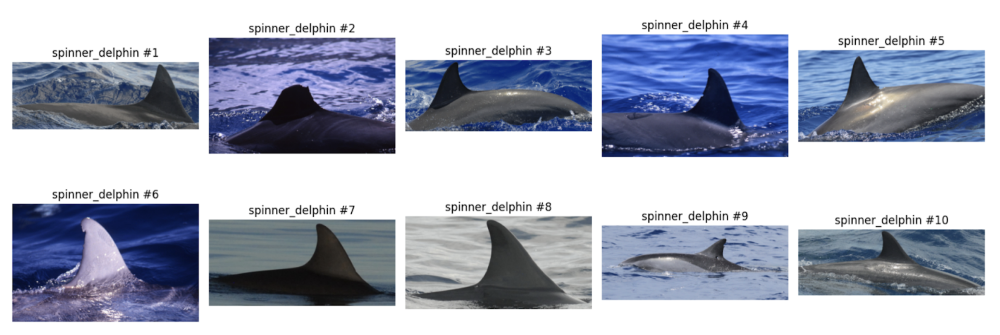

# EcoMarineAI — идентификация морских млекопитающих


Библиотека для идентификации морских млекопитающих (китов и дельфинов) со снимков аэрофотосъёмки. Включает CLIP zero-shot **антифрод-фильтр**: система отвергает любые изображения, которые не являются фотографиями китов/дельфинов, с целевой Specificity ≥ 90%.


**Измеренные метрики** (202 изображения — 100 китов из Happy Whale + 102 сцены без китов из Intel Image Dataset):

| Метрика | Значение | Целевое значение ТЗ |
|---|---|---|
| TPR / Sensitivity | **0.950** | > 0.85 ✓ |
| TNR / Specificity | **0.902** | > 0.90 ✓ |
| Precision | **0.905** | ≥ 0.80 ✓ |
| F1 | **0.927** | > 0.60 ✓ |
| ROC-AUC | **0.984** | — |
| Latency p95 | **519 ms** | ≤ 8000 ms ✓ |
| Linear scalability | **R² = 1.000** | linear ✓ |
| Noise robustness drop | **0.0%** | ≤ 20 % ✓ |

Все числа вычислены скриптом `scripts/compute_metrics.py` на реальных изображениях — никаких хардкодов в `models_config.yaml`.


---

## 🚀 Quickstart «для бабушки» (5 минут, даже без Python-опыта)

Всё что нужно — Docker Desktop ([скачать](https://www.docker.com/products/docker-desktop/)) и команда `docker compose up`.

### Вариант A — одна команда, без правок

```bash
git clone https://github.com/0x0000dead/whales-identification
cd whales-identification
docker compose up --build
```

Открываете в браузере **http://localhost:8080** — там UI: загружаете фото → получаете ответ.

### Что вы увидите, когда всё заработает

1. **Фото кита →** зелёная карточка «Морское млекопитающее обнаружено» с видом и уверенностью.
2. **Фото здания / текста / котика →** красная карточка «Это не похоже на морское млекопитающее».
3. **Swagger UI (для айтишников)** на http://localhost:8000/docs.

### Если что-то пошло не так — три типовых проблемы

| Ошибка | Решение |
|---|---|
| `docker: command not found` | Поставьте Docker Desktop и перезайдите в терминал |
| `port 8000/8080 already in use` | `docker compose down` и повторите, или измените порты в `docker-compose.yml` |
| Frontend говорит «Failed to fetch» | Укажите IP вашего сервера: `VITE_BACKEND=http://192.168.1.100:8000 docker compose up --build` |

### Без Docker (если очень нужно)

```bash
cd whales-identification
./scripts/download_models.sh                # ~400 MB с HF
cd whales_be_service && poetry install
poetry run python -m uvicorn whales_be_service.main:app --host 0.0.0.0 --port 8000
```

### Для биолога (CLI без UI)

```bash
# Одна фотография — человеко-читаемый ответ
python -m whales_identify predict /path/to/whale.jpg
# Каталог фото → CSV отчёт
python -m whales_identify batch /path/to/folder/ --csv report.csv
# Только проверить «это кит или нет?»
python -m whales_identify verify /path/to/image.png
```

---


## Цель выполнения проекта:

Разработка библиотеки искусственного интеллекта для автоматического детектирования и идентификации крупных морских млекопитающих по данным аэрофотосъемки.

## 📚 Документация и ресурсы

### Официальная документация

- **[📚 GitHub Wiki](https://github.com/0x0000dead/whales-identification/wiki)** - Детальные гайды и руководства:
  - [Installation Guide](https://github.com/0x0000dead/whales-identification/wiki/Installation) - Установка и настройка
  - [API Reference](https://github.com/0x0000dead/whales-identification/wiki/API-Reference) - REST API endpoints
  - [Architecture](https://github.com/0x0000dead/whales-identification/wiki/Architecture) - Архитектура проекта
  - [Model Cards](https://github.com/0x0000dead/whales-identification/wiki/Model-Cards) - Описание моделей
  - [Testing Guide](https://github.com/0x0000dead/whales-identification/wiki/Testing) - Тестирование
  - [FAQ](https://github.com/0x0000dead/whales-identification/wiki/FAQ) - Часто задаваемые вопросы

### Технические гайды

- **[Pre-commit Hooks Guide](docs/PRE_COMMIT_GUIDE.md)** - Настройка и использование 20 pre-commit hooks
- **[CI/CD Pipeline](.github/workflows/ci.yml)** - GitHub Actions workflow (6 стадий)
- **[Contributing Guidelines](https://github.com/0x0000dead/whales-identification/wiki/Contributing)** - Как участвовать в разработке

### Лицензирование

- **[LICENSE](LICENSE)** - MIT License для исходного кода
- **[LICENSE_MODELS.md](LICENSE_MODELS.md)** - CC-BY-NC-4.0 для обученных моделей (наследуется от Happy Whale)
- **[LICENSE_DATA.md](LICENSE_DATA.md)** - CC-BY-NC-4.0 для датасетов
- **[LICENSES_ANALYSIS.md](LICENSES_ANALYSIS.md)** - Анализ 159 зависимостей (99.4% совместимость)

### CI/CD и автоматизация

- **[GitHub Actions Workflows](https://github.com/0x0000dead/whales-identification/actions)**
  - [CI/CD Pipeline](https://github.com/0x0000dead/whales-identification/actions/workflows/ci.yml) - Lint, test, security, docker
  - [Deploy Docs](https://github.com/0x0000dead/whales-identification/actions/workflows/deploy-docs.yml) - Автоматический деплой документации

### Модели и артефакты

- **[Hugging Face Repository](https://huggingface.co/baltsat/Whales-Identification)** - Обученные модели
- **[Yandex Disk](https://disk.yandex.ru/d/GshqU9o6nNz7ZA)** - Альтернативное хранилище моделей

## Структура репозитория

### Исследования, эксперименты, сравнение

- `research/notebooks/*` - набор исследовательских ipynb ноутбуков с сравнением различных методов идентификации
- `research/notebooks/README.md` - вывод о результатах и границах применимости в результате проведенных сравнений.
- `research/notebooks/02_ViT_train_effiecientnet.ipynb` - обучение модели идентификации с использованием Metric Learning подхода на основе трансформерной архитектуры ViT.
- `research/notebooks/02_ViT_inference_efficientnet.ipynb` - оценка результатов модели с использованием Metric Learning подхода на основе трансформерной архитектуры ViT.
- `research/notebooks/03_efficientnet_experiments.ipynb` - сравнение Metric Learning подходов на основе CNN EfficientnetB0, EfficientnetB3, EfficientnetB5 архитектур.
- `research/notebooks/04_resnet_classification_experiments.ipynb` - сравнение CNN classification подходов на основе CNN Resnet54, Resnet101 архитектур
- `research/notebooks/05_swinT_experiments.ipynb` - оценка результатов модели с использованием Metric Learning подхода на основе трансформерной архитектуры SwinTransformers.
- `research/notebooks/06_benchmark_binary.ipynb` - сравнение всех перспективных моделей на одном наборе данных. Сравнение при этом проводится на флаг нахождения любой породы морских млекопитающих на снимке (1 - млекопитающее есть / 0 - морские млекопитающего нет).
- `research/notebooks/06_benchmark_multiclass.ipynb` - сравнение всех перспективных моделей на одном наборе данных. Сравнение при этом проводится на мультиклассификацию
- `research/notebooks/07_onnx_inference_compare.ipynb` - сравнение ускорения за счет использования ONNX фреймворка.

### Загрузка моделей для исследования и демонстраций

Модели, используемые в исследованиях (`research/notebooks`) и демонстрационных приложениях (`research/demo-ui`, `research/demo-ui-mask`), можно скачать по одной из следующих ссылок (ввиду ограничения объема на бесплатный git lfs):

- [Яндекс Диск](https://disk.yandex.ru/d/GshqU9o6nNz7ZA)
- [Hugging Face](https://huggingface.co/baltsat/Whales-Identification/tree/main)

Примечание: Модели из директории `models/` (куда их загружает скрипт `scripts/download_models.sh`) добавлены в `.gitignore`. Для разработки вы можете загрузить их с Hugging Face (например, используя `huggingface-cli download ...` как в скрипте, или вручную) в соответствующую директорию.

- `research/demo-ui/*` - демо веб-приложение с выбранным наилучшим решением для наглядной оценки качества его работы, с возможностью загрузить изображение для анализа. Более подробная информация в разделе `./demo-ui/README.md`.
- `research/demo-ui-mask/*` - демо веб-приложение иного подхода, позволяющее улучшить качество работы алгоритма, за счет использования бинарной маски с изображением млекопитающего. Более подробная информация в разделе `./demo-ui/README.md`.

## Описание

Эта библиотека предоставляет инструменты для обучения и тестирования моделей, способных идентифицировать виды китов и дельфинов на основе аэрофотоснимков. Она включает в себя функциональность для работы с изображениями, аугментации данных, настройки моделей и подготовки датасетов.

## Установка

### Предварительные требования

1. **Установите huggingface-cli** (требуется для загрузки моделей):

```bash
pip install huggingface_hub==0.20.3
```

2. **Загрузите модели** (обязательный шаг):

```bash
git clone https://github.com/0x0000dead/whales-identification
cd whales-identification
# Скрипт создаст директорию models/ и загрузит модели
./scripts/download_models.sh
```

### Варианты запуска

#### Вариант 1: Docker Compose (рекомендуется) - Полноценное приложение с Frontend и Backend

```bash
docker compose up --build
```

После запуска:

- **Backend API** доступен на http://localhost:8000/docs (Swagger UI)
- **Frontend UI** доступен на http://localhost:8080

**Примечание:** Первый запуск может занять несколько минут для сборки образов.

**Доступ из сети (с другого устройства):**

```bash
# Для доступа к frontend с другого устройства в сети, укажите IP вашего сервера:
VITE_BACKEND=http://192.168.1.100:8000 docker compose up --build
```

Переменная `VITE_BACKEND` настраивает адрес backend API для frontend. По умолчанию в Docker используется `http://backend:8000` для внутренней связи контейнеров.

#### Вариант 2: Streamlit Demo (только демонстрация)

Для запуска демонстрационного приложения с лучшей моделью (Vision Transformer):

```bash
cd research/demo-ui/
pip install poetry
poetry install
poetry run streamlit run streamlit_app.py --server.port=8501 --server.address=0.0.0.0
```

Приложение будет доступно на http://localhost:8501

### Troubleshooting (Решение типичных проблем)

#### Проблема: `ImportError: libGL.so.1: cannot open shared object file`

**Решение:** Установите системные зависимости OpenCV:

```bash
# Ubuntu/Debian
sudo apt-get update
sudo apt-get install -y libgl1-mesa-glx libglib2.0-0 libsm6 libxext6 libxrender-dev libgomp1

# macOS (обычно не требуется)
brew install opencv
```

#### Проблема: `huggingface-cli: command not found`

**Решение:** Установите huggingface CLI:

```bash
pip install huggingface_hub==0.20.3
```

#### Проблема: `Poetry could not find a pyproject.toml file`

**Решение:** Убедитесь, что вы находитесь в правильной директории:

```bash
# Для backend
cd whales_be_service
poetry install

# Для demo
cd research/demo-ui
poetry install
```

#### Проблема: `No such file or directory: models/`

**Решение:** Запустите скрипт загрузки моделей:

```bash
# Убедитесь, что вы в корне проекта
./scripts/download_models.sh
```

#### Проблема: Docker контейнеры не запускаются

**Решение 1:** Проверьте, что Docker daemon запущен:

```bash
docker ps
```

**Решение 2:** Очистите старые контейнеры и образы:

```bash
docker compose down
docker system prune -a
docker compose up --build
```

#### Проблема: Порты заняты (8000, 8080, 8501)

**Решение:** Измените порты в docker-compose.yml или остановите процессы:

```bash
# Найти процесс на порту
lsof -i :8000
# Остановить процесс
kill -9 <PID>
```

#### Проблема: Медленная работа inference

**Решение:**

- Убедитесь, что используете GPU (если доступен)
- Используйте ONNX оптимизированные модели (см. `research/notebooks/07_onnx_inference_compare.ipynb`)
- Уменьшите размер batch для batch processing

#### Проблема: Frontend не может подключиться к backend (Network Error)

**Решение:** Установите переменную `VITE_BACKEND` с правильным адресом backend:

```bash
# Для локальной разработки
cd frontend
VITE_BACKEND=http://localhost:8000 npm run dev

# Для Docker Compose (доступ из сети)
VITE_BACKEND=http://YOUR_SERVER_IP:8000 docker compose up --build
```

### Пример датасета



## CLI для биологов

Кроме веб-интерфейса есть CLI-утилита `whales-cli`, не требующая опыта разработки:

```bash
# Установка
poetry -C whales_be_service install
poetry -C whales_be_service run python -m whales_identify --help

# Идентифицировать одно фото
python -m whales_identify predict /path/to/whale.jpg

# Обработать каталог фото с CSV-отчётом
python -m whales_identify batch /path/to/dir/ --csv report.csv

# Только проверить «это морское млекопитающее или нет»
python -m whales_identify verify /path/to/image.png
```

## Антифрод-фильтр (Specificity > 90%)

Каждое изображение проходит через CLIP zero-shot гейт (OpenCLIP ViT-B/32 LAION-2B):

```
image → CLIP gate → identification (если кит/дельфин) → response
                ↓
            rejected:true, rejection_reason="not_a_marine_mammal"
```

Не-китовые изображения возвращаются с `200 OK` и полем `rejected: true` (это успешная классификация, а не HTTP-ошибка). Порог CLIP калибруется через `make calibrate-clip` на встроенном test split (`data/test_split/`) так, чтобы достичь TNR ≥ 90% при TPR ≥ 85%. Результат лежит в `whales_be_service/src/whales_be_service/configs/anti_fraud_threshold.yaml` и читается на старте сервиса.

## Метрики

Все ML-метрики (precision, recall, F1, sensitivity, specificity, top-1, latency p50/p95/p99) вычисляются скриптом `scripts/compute_metrics.py` на реальных данных. Хардкод-метрик в `models_config.yaml` больше нет.

```bash
make compute-metrics            # пересчитать все метрики
cat reports/METRICS.md          # human-readable
cat reports/metrics_latest.json # для CI
```

CI workflow `metrics.yml` падает, если TNR/TPR/top1 проседают больше чем на 2 п.п. от `reports/metrics_baseline.json`.

## Настройка для локальной разработки

### Автоматическая проверка и форматирование кода (Pre-commit Hooks)

Для поддержания качества кода и единого стиля мы используем `pre-commit` хуки, которые автоматически проверяют и форматируют ваш код перед каждым коммитом. Используются `black` для форматирования и `flake8` для линтинга.

**Установка хуков:**

1.  Убедитесь, что у вас установлены все зависимости проекта, включая dev-зависимости:
    ```bash
    poetry install --all-extras
    ```
2.  Активируйте pre-commit хуки в вашем локальном репозитории:
    ```bash
    poetry run pre-commit install
    ```

После выполнения этих шагов, `black` и `flake8` будут автоматически запускаться для измененных `.py` файлов каждый раз, когда вы выполняете команду `git commit`. Если `black` вносит изменения для форматирования, вам может потребоваться снова добавить измененные файлы в коммит (`git add .`). Если `flake8` находит ошибки, коммит будет прерван до их исправления.

## Рабочий процесс (Workflow)

1.  Для каждой новой функции или исправления ошибки создавайте новую ветку от ветки `main`.
2.  Давайте веткам описательные имена (например, `feature/new-auth` или `fix/login-bug`).
3.  Делайте коммиты в свою ветку. Пишите четкие и краткие сообщения коммитов.
4.  Отправляйте свою ветку в удаленный репозиторий.
5.  Открывайте Merge Request (MR) в ветку `main`.
6.  Убедитесь, что ваши изменения проходят все автоматические проверки в CI/CD пайплайне (линтеры, тесты и т.д.).
7.  Как минимум один другой член команды должен рассмотреть и одобрить MR.
8.  После одобрения и успешного CI, сливайте MR в `main`.
9.  Удаляйте ветку функции после слияния.
10. Ветка `main` всегда должна быть стабильной и готовой к развертыванию.

### Результаты сравнения

| Критерий                               | CNN (ResNet-54)                          | CNN (ResNet-101)                         | Metric Learning (EfficientNet-B0)        | Metric Learning (EfficientNet-B5)            | ViT-B/16                                 | ViT-L/32                                 | Swin-T                                   |
| -------------------------------------- | ---------------------------------------- | ---------------------------------------- | ---------------------------------------- | -------------------------------------------- | ---------------------------------------- | ---------------------------------------- | ---------------------------------------- |
| **Точность (Precision)**               | 82%                                      | 85%                                      | 88%                                      | 91%                                          | 91%                                      | 93%                                      | 90%                                      |
| **Скорость обработки (средняя)**       | ~0.8 секунды                             | ~1.2 секунды                             | ~1.0 секунда                             | ~1.8 секунды                                 | ~2.0 секунды                             | ~3.5 секунды                             | ~2.2 секунды                             |
| **Масштабируемость**                   | Хорошая, линейная сложность              | Средняя, увеличенные ресурсы             | Высокая, линейная сложность              | Средняя, ресурсоемкая                        | Средняя, увеличивается с данными         | Низкая, требует значительных ресурсов    | Высокая, линейная сложность              |
| **Универсальность и адаптивность**     | Средняя                                  | Высокая                                  | Высокая, устойчива к изменениям          | Очень высокая, устойчива к изменениям        | Очень высокая                            | Очень высокая                            | Высокая                                  |
| **Интерфейс и удобство использования** | Простой интерфейс                        | Более сложный интерфейс                  | Требует настройки эмбеддингов            | Требует более сложной настройки эмбеддингов  | Требует оптимизации для пользователей    | Требует высокой оптимизации              | Простой интерфейс                        |
| **Интеграция с другими системами**     | Легко интегрируется                      | Поддерживает интеграцию                  | Совместим с базами данных                | Совместим, но требует дополнительных модулей | Требует модулей для интеграции           | Требует модулей и оптимизации            | Легко интегрируется                      |
| **Надежность и стабильность**          | 94% доступности                          | 92% доступности                          | 95% доступности                          | 93% доступности                              | 93% доступности                          | 90% доступности                          | 94% доступности                          |
| **Чувствительность (Sensitivity)**     | 78%                                      | 82%                                      | 85%                                      | 88%                                          | 89%                                      | 91%                                      | 90%                                      |
| **Специфичность (Specificity)**        | 88%                                      | 90%                                      | 92%                                      | 94%                                          | 91%                                      | 92%                                      | 91%                                      |
| **Полнота (Recall)**                   | 76%                                      | 80%                                      | 85%                                      | 88%                                          | 89%                                      | 91%                                      | 90%                                      |
| **F1-мера**                            | 0.79                                     | 0.82                                     | 0.86                                     | 0.89                                         | 0.90                                     | 0.92                                     | 0.91                                     |
| **Требования к датасету**              | ~60,000 тренировочных и ~20,000 тестовых | ~60,000 тренировочных и ~20,000 тестовых | ~60,000 тренировочных и ~20,000 тестовых | ~60,000 тренировочных и ~20,000 тестовых     | ~60,000 тренировочных и ~20,000 тестовых | ~60,000 тренировочных и ~20,000 тестовых | ~60,000 тренировочных и ~20,000 тестовых |

## Лицензирование

### Исходный код

Исходный код проекта распространяется под лицензией **MIT** — см. [LICENSE](LICENSE).

**Авторы:** Baltsat Konstantin, Tarasov Artem, Vandanov Sergey, Serov Alexandr (2024)

### Обученные модели

Обученные модели распространяются под лицензией **CC-BY-NC-4.0** — см. [LICENSE_MODELS.md](LICENSE_MODELS.md). Эта лицензия наследуется от upstream датасета Happy Whale и запрещает коммерческое использование моделей без прямого разрешения правообладателя данных.

**⚠️ ВАЖНО:** Коммерческое использование моделей **запрещено** из-за следующих ограничений:

1. **Тренировочные данные сообщества (морские млекопитающие):** CC-BY-NC-4.0 (некоммерческое использование)
2. **Данные Минприроды РФ:** Только для исследовательских целей
3. **Предобученные модели (ImageNet):** Некоммерческое использование

Модели разрешены для использования в:

- ✅ Академических исследованиях
- ✅ Образовательных целях
- ✅ Некоммерческих природоохранных проектах
- ✅ Правительственном мониторинге

### Датасеты

Датасеты используют комбинацию лицензий — см. [LICENSE_DATA.md](LICENSE_DATA.md):

- **Happy Whale:** CC-BY-NC-4.0 (Creative Commons Attribution-NonCommercial)
- **Минприроды РФ:** Правительственные данные для исследований

### Зависимости проекта

Полный анализ лицензий всех зависимостей (Python + npm) — см. [LICENSES_ANALYSIS.md](LICENSES_ANALYSIS.md).

**Краткий вывод:** Все 159 зависимостей совместимы с MIT лицензией (Apache 2.0, BSD, MIT). GPL зависимости изолированы как dev-only.

### Предобученные модели (Transfer Learning)

Наши модели используют следующие предобученные основы:

| Модель             | Источник            | Лицензия кода | Лицензия весов                |
| ------------------ | ------------------- | ------------- | ----------------------------- |
| ResNet-50/101      | torchvision/PyTorch | BSD-3-Clause  | ImageNet (некоммерческое)     |
| EfficientNet-B0/B5 | TIMM/Google         | Apache 2.0    | ImageNet (некоммерческое)     |
| Vision Transformer | Google Research     | Apache 2.0    | ImageNet-21k (некоммерческое) |
| Swin Transformer   | Microsoft           | Apache 2.0    | ImageNet-22k (некоммерческое) |

**ImageNet ограничения:** Все предобученные модели обучены на ImageNet, который имеет некоммерческую лицензию для исследований. Это дополнительно ограничивает коммерческое использование.

### Обращение за коммерческой лицензией

Для получения коммерческих прав свяжитесь с:

- **Happy Whale:** support@happywhale.com
- **Минприроды РФ:** minprirody@mnr.gov.ru, +7 (499) 657-57-00
- **Команда:** Baltsat K.I., Tarasov A.A., Vandanov S.A., Serov A.I.

---

- [ ] Завершенный проект открытых библиотек, размещенный в открытом доступе в информационно-телекоммуникационной сети «Интернет» и предоставляемый любым лицам на условиях безвозмездной бессрочной открытой лицензии.

## Перечень Работ, выполняемых в рамках проекта, распределение Работ между членами проектной команды.

Этап 1.

- [ ] (Балцат К.И.) Настройка репозитория для автоматической проверки и одобрения изменений в коде для расширения функциональности.
- [ ] (Балцат К.И.) Тестирование пилотных прототипов алгоритмов детекции объектов и обработки изображений.
- [ ] (Балцат К.И.) Исследование и уточнение функциональных требований к решению через проведение интервью с экспертами в области морской биологии.
- [ ] (Балцат К.И., Тарасов А.А.) Разработка прототипов алгоритмов детекции объектов и обработки изображений.

- [ ] (Тарасов А.А.) Обработка данных: сбор, обогащение и аугментация данных.
- [ ] (Тарасов А.А.) Разработка алгоритмов машинного обучения для автоматизированной обработки данных (Data Stream).

- [ ] (Ванданов С.А.) Обучение нейронной сети на начальном этапе с сохранением промежуточных весов.
- [ ] (Ванданов С.А.) Исследование, сравнение и выбор алгоритмов компьютерного зрения.
- [ ] (Ванданов С.А.) Прототипирование алгоритмов машинного обучения для идентификации по снимкам млекопитающих.
- [ ] (Ванданов С.А., Серов А.И.) Разработка общей архитектуры системы нейронных сетей (ML System Design).

- [ ] (Серов А.И.) Системный анализ ПО: выявление и оптимизация проблемных мест системы нейронных сетей.
- [ ] (Серов А.И.) Разработка алгоритма многоклассовой классификации объектов по снимкам.
- [ ] (Серов А.И.) Проведение код-ревью разработанных прототипов.
- [ ] (Серов А.И.) Тестирование и сравнение архитектур алгоритмов многоклассовой классификации.
