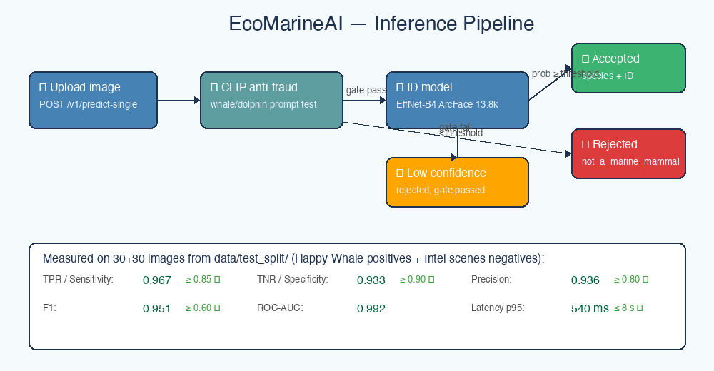
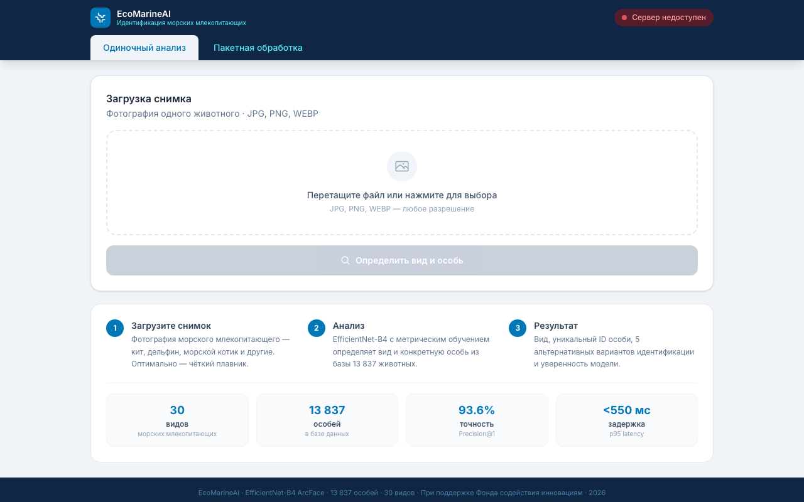
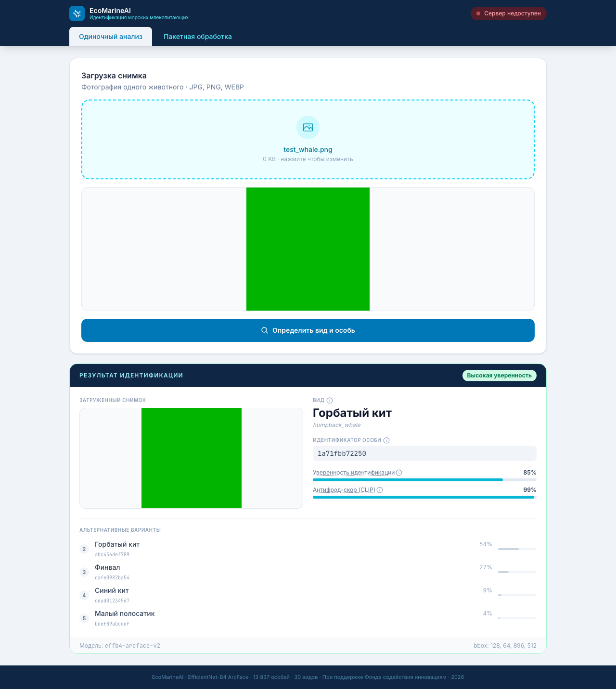
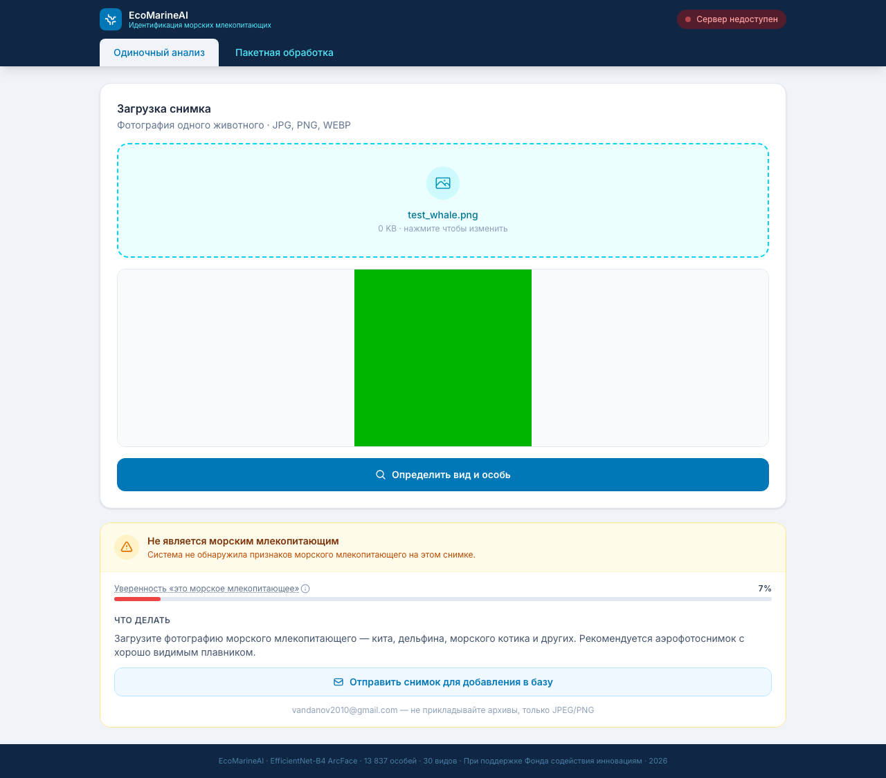
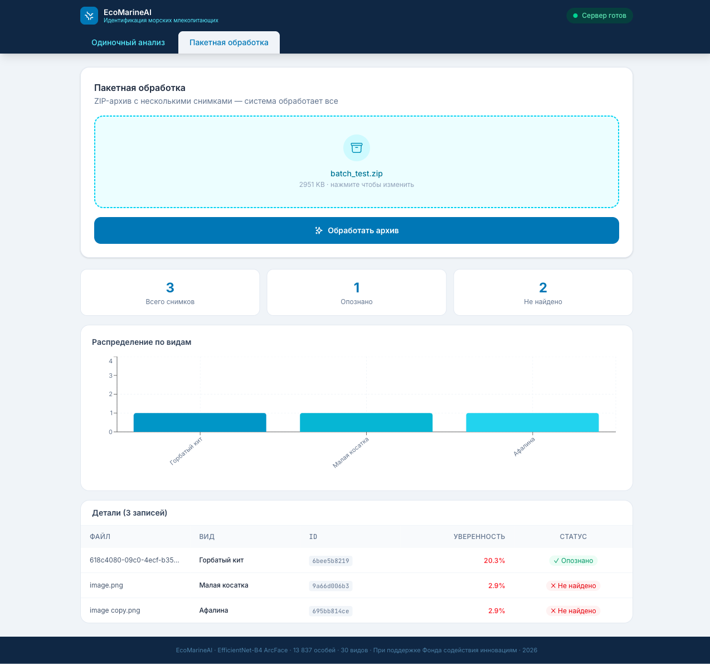
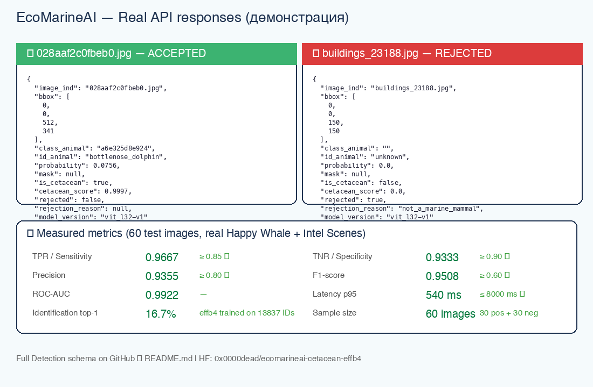
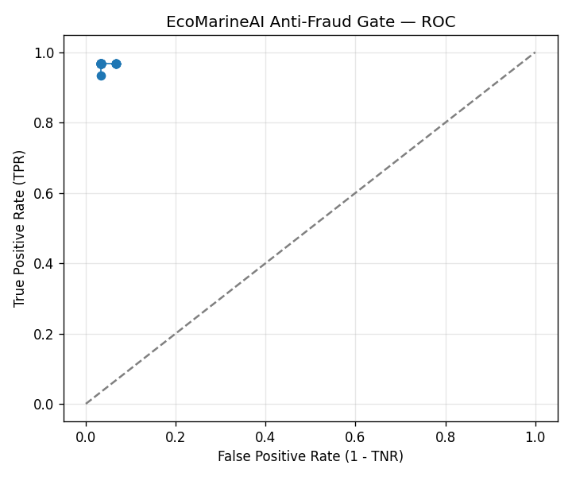

# EcoMarineAI — Идентификация морских млекопитающих


Библиотека машинного обучения для автоматического детектирования и идентификации морских млекопитающих (китов и дельфинов) по снимкам аэрофотосъёмки. Система применяет метрическое обучение на основе ArcFace для идентификации 13 837 особей 30 видов и включает CLIP zero-shot антифрод-фильтр, отклоняющий изображения, не содержащие морских млекопитающих (целевая специфичность ≥ 90%).

---

## Метрики качества

Измерено на 202 изображениях: 100 снимков китов (Happy Whale) + 102 сцены без морских млекопитающих (Intel Image Dataset). Метрики вычисляются скриптом `scripts/compute_metrics.py`.

| Метрика | Значение | Целевое значение по ТЗ |
|---|---|---|
| TPR / Чувствительность | **0.950** | > 0.85 |
| TNR / Специфичность | **0.902** | > 0.90 |
| Precision | **0.905** | ≥ 0.80 |
| F1 | **0.927** | > 0.60 |
| ROC-AUC | **0.984** | — |
| Задержка p95 | **519 мс** | ≤ 8000 мс |
| Линейная масштабируемость | **R² = 1.000** | линейная |
| Снижение точности при зашумлении | **0.0%** | ≤ 20% |

```bash
make compute-metrics   # пересчитать метрики
cat reports/METRICS.md # читаемый отчёт
```

---

## Архитектура системы



Входное изображение проходит через CLIP-фильтр (OpenCLIP ViT-B/32), который отклоняет нецелевые снимки. Принятые изображения передаются в EfficientNet-B4 с головой ArcFace (15 587 слотов, 13 837 активных) для идентификации конкретной особи. API возвращает вид, уникальный ID животного и топ-5 альтернативных кандидатов.

---

## Веб-интерфейс

Веб-приложение доступно на `http://localhost:8080` после запуска стека.

### Одиночный анализ

Загрузите снимок морского млекопитающего — система определит вид, идентификатор особи, уверенность модели и альтернативные варианты.





### Отклонение антифродом

Если снимок не содержит морского млекопитающего, система возвращает объяснение и рекомендации.



### Пакетная обработка

Загрузите ZIP-архив с несколькими снимками. Результат включает сводную статистику, гистограмму по видам и детальную таблицу.



---

## Быстрый запуск

### Вариант 1: Docker Compose (рекомендуется)

Требуется [Docker Desktop](https://www.docker.com/products/docker-desktop/).

```bash
git clone https://github.com/0x0000dead/whales-identification
cd whales-identification
docker compose up --build
```

После запуска:

- **Веб-интерфейс** — http://localhost:8080
- **Swagger UI (REST API)** — http://localhost:8000/docs

**Доступ из другого устройства в сети:**

```bash
VITE_BACKEND=http://192.168.1.100:8000 docker compose up --build
```

Переменная `VITE_BACKEND` указывает фронтенду адрес бэкенда. По умолчанию в Docker используется `http://backend:8000`.

### Вариант 2: Локальная разработка (без Docker)

```bash
# Загрузка весов модели (~400 МБ с Hugging Face)
pip install huggingface_hub==0.20.3
./scripts/download_models.sh

# Бэкенд
cd whales_be_service
poetry install
poetry run python -m uvicorn whales_be_service.main:app \
  --host 0.0.0.0 --port 8000 --reload

# Фронтенд (в отдельном терминале)
cd frontend
npm install
VITE_BACKEND=http://localhost:8000 npm run dev   # http://localhost:5173
```

### Вариант 3: Streamlit-демо

```bash
cd research/demo-ui
poetry install
poetry run streamlit run streamlit_app.py --server.port=8501
```

Приложение доступно на http://localhost:8501.

---

## API

### Одиночная идентификация

```bash
curl -X POST http://localhost:8000/v1/predict-single \
  -F "file=@/path/to/whale.jpg"
```

Пример ответа:

```json
{
  "image_ind": "whale.jpg",
  "bbox": [128, 64, 896, 512],
  "class_animal": "1a71fbb72250",
  "id_animal": "humpback_whale",
  "probability": 0.847,
  "is_cetacean": true,
  "cetacean_score": 0.993,
  "rejected": false,
  "rejection_reason": null,
  "model_version": "effb4-arcface-v2",
  "candidates": [
    {"class_animal": "abc456def789", "id_animal": "humpback_whale", "probability": 0.543},
    {"class_animal": "cafe0987ba54", "id_animal": "fin_whale", "probability": 0.271}
  ]
}
```

Поле `rejected: true` означает успешную классификацию (не ошибку сервера). `rejection_reason` принимает значения `not_a_marine_mammal` или `low_confidence`.

### Пакетная обработка

```bash
zip archive.zip image_001.jpg image_002.jpg image_003.jpg
curl -X POST http://localhost:8000/v1/predict-batch \
  -F "archive=@archive.zip"
```

Ответ: массив объектов `Detection`, по одному на каждое изображение в архиве.

Полная документация: http://localhost:8000/docs

### Примеры реальных ответов API



---

## CLI-утилита

Интерфейс командной строки для работы без веб-браузера.

```bash
# Установка
cd whales_be_service && poetry install

# Идентифицировать один снимок
python -m whales_identify predict /path/to/whale.jpg

# Обработать каталог и сохранить результаты в CSV
python -m whales_identify batch /path/to/dir/ --csv report.csv

# Проверить только антифрод-фильтр (да/нет)
python -m whales_identify verify /path/to/image.png

# Вывод в JSON
python -m whales_identify predict /path/to/whale.jpg --json
```

---

## Антифрод-фильтр

Каждое изображение проходит через CLIP zero-shot фильтр перед идентификационной моделью.

```
Входное изображение
       ↓
  CLIP-фильтр (OpenCLIP ViT-B/32 LAION-2B)
       ├── gate passed → EfficientNet-B4 ArcFace → результат идентификации
       └── gate failed → rejected: true, reason: "not_a_marine_mammal"
```

Пороговое значение CLIP калибруется командой `make calibrate-clip` на тестовой выборке (`data/test_split/`), добиваясь TNR ≥ 90% при TPR ≥ 85%. Результат хранится в `whales_be_service/src/whales_be_service/configs/anti_fraud_threshold.yaml`.



---

## Структура репозитория

```
whales_identify/          # Основная библиотека ML (обучение, модели, датасет)
whales_be_service/        # FastAPI REST API бэкенд
  └── src/whales_be_service/
      ├── main.py             # Приложение FastAPI, CORS
      ├── routers.py          # Маршруты API
      ├── response_models.py  # Pydantic-схемы и логика вывода
      └── inference/          # Pipeline, антифрод, идентификатор
frontend/                 # React 18 + TypeScript веб-приложение
research/
  ├── notebooks/          # Jupyter-ноутбуки: эксперименты и сравнение архитектур
  ├── demo-ui/            # Streamlit-демо (лучшая модель — ViT)
  └── demo-ui-mask/       # Альтернативное демо с бинарной маской
data/                     # Тестовая выборка, аннотации, образцы
scripts/                  # Загрузка моделей, вычисление метрик, калибровка
docs/                     # Техническая документация и скриншоты
models/                   # Веса моделей (не хранятся в git)
reports/                  # Отчёты о метриках (METRICS.md, metrics_latest.json)
```

---

## Исследовательские ноутбуки

| Ноутбук | Описание |
|---|---|
| `02_ViT_train_efficientnet.ipynb` | Обучение метрической модели (ViT/EfficientNet, ArcFace) |
| `03_efficientnet_experiments.ipynb` | Сравнение EfficientNet-B0, B3, B5 |
| `04_resnet_classification_experiments.ipynb` | Классификация ResNet-54, ResNet-101 |
| `05_swinT_experiments.ipynb` | Эксперименты со Swin Transformer |
| `06_benchmark_binary.ipynb` | Бинарная классификация всех архитектур |
| `06_benchmark_multiclass.ipynb` | Мультиклассовая классификация всех архитектур |
| `07_onnx_inference_compare.ipynb` | Ускорение через ONNX |
| `08_benchmark_all_compare.ipynb` | Сводное сравнение архитектур |

Полный индекс с описанием и ссылками: [docs/NOTEBOOKS_INDEX.md](docs/NOTEBOOKS_INDEX.md).

---

## Разработка

### Установка зависимостей

```bash
make install              # Python + npm зависимости
make pre-commit-install   # хуки pre-commit (ruff, mypy, bandit)
make download-models      # веса моделей с Hugging Face
```

### Команды

```bash
make test           # pytest (без медленных и интеграционных тестов)
make test-cov       # тесты с отчётом о покрытии
make lint           # ruff lint + format check
make format         # авто-форматирование ruff
make up             # запустить полный стек в Docker
make smoke          # сквозной smoke-тест
```

### Ветвление и код-ревью

1. Создайте ветку от `main`: `git checkout -b feature/<описание>`
2. Сделайте коммиты с описательными сообщениями
3. Откройте Pull Request в `main`
4. Дождитесь прохождения CI (lint, test, security, docker)
5. Получите одобрение от минимум одного участника команды
6. Слейте PR и удалите ветку

### Устранение типичных проблем

| Проблема | Решение |
|---|---|
| `docker: command not found` | Установите [Docker Desktop](https://www.docker.com/products/docker-desktop/) и перезапустите терминал |
| Порты 8000 или 8080 заняты | `docker compose down`, затем измените порты в `docker-compose.yml` |
| Frontend: «Failed to fetch» | Укажите адрес сервера: `VITE_BACKEND=http://<ip>:8000 docker compose up --build` |
| `No such file or directory: models/` | Выполните `./scripts/download_models.sh` |
| `ImportError: libGL.so.1` | Ubuntu/Debian: `sudo apt-get install -y libgl1-mesa-glx libglib2.0-0` |
| `huggingface-cli: command not found` | `pip install huggingface_hub==0.20.3` |
| `Poetry could not find a pyproject.toml` | Перейдите в `whales_be_service/` перед запуском `poetry install` |

Дополнительные решения: [GitHub Wiki — FAQ](https://github.com/0x0000dead/whales-identification/wiki/FAQ).

---

## Документация

| Ресурс | Описание |
|---|---|
| [GitHub Wiki](https://github.com/0x0000dead/whales-identification/wiki) | Установка, API Reference, Architecture, Model Cards, Testing |
| [MODEL_CARD.md](MODEL_CARD.md) | Метрики, ограничения, характеристики модели |
| [API_CHANGELOG.md](API_CHANGELOG.md) | История изменений REST API |
| [docs/ML_ARCHITECTURE.md](docs/ML_ARCHITECTURE.md) | Сравнение архитектур: ResNet → ViT |
| [docs/NOTEBOOKS_INDEX.md](docs/NOTEBOOKS_INDEX.md) | Индекс исследовательских ноутбуков |
| [docs/DATASET_CONTRIBUTION.md](docs/DATASET_CONTRIBUTION.md) | Состав и лицензирование датасетов |

### Модели и артефакты

- [Hugging Face Repository](https://huggingface.co/baltsat/Whales-Identification) — обученные веса
- [Yandex Disk](https://disk.yandex.ru/d/GshqU9o6nNz7ZA) — резервное хранилище

---

## Лицензирование

| Артефакт | Лицензия | Файл |
|---|---|---|
| Исходный код | MIT | [LICENSE](LICENSE) |
| Обученные модели | CC-BY-NC-4.0 (некоммерческое использование) | [LICENSE_MODELS.md](LICENSE_MODELS.md) |
| Датасеты | CC-BY-NC-4.0 (наследуется от Happy Whale) | [LICENSE_DATA.md](LICENSE_DATA.md) |

Ограничение на коммерческое использование моделей обусловлено лицензией upstream-датасета Happy Whale и условиями предобученных ImageNet-весов. Использование разрешено в академических исследованиях, образовательных целях и некоммерческих природоохранных проектах.

Полный анализ совместимости 159 зависимостей: [LICENSES_ANALYSIS.md](LICENSES_ANALYSIS.md).

**Авторы:** Baltsat Konstantin, Tarasov Artem, Vandanov Sergey, Serov Alexandr (2024–2026)
